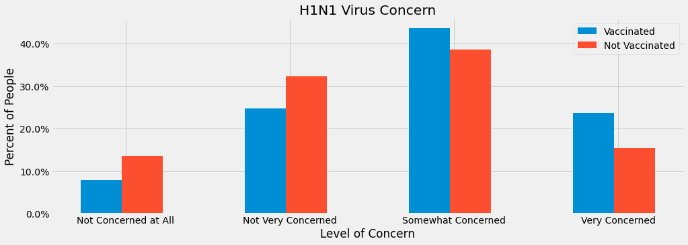
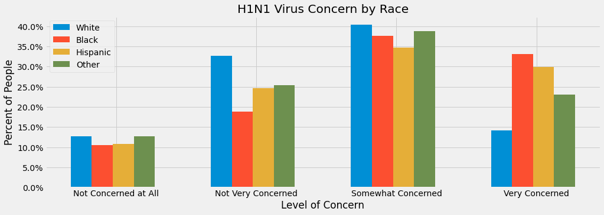
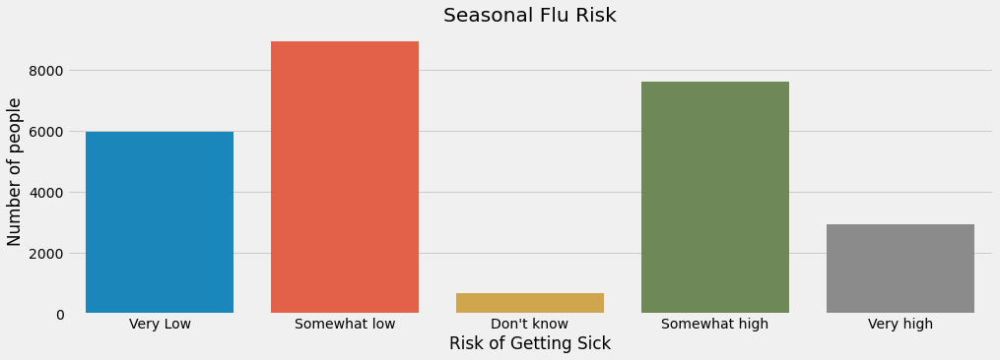
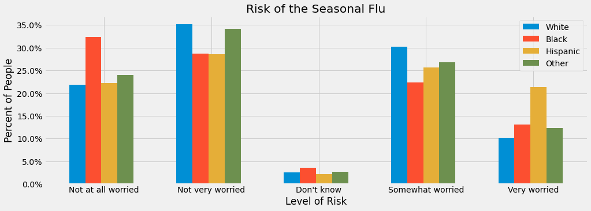

# Capstone
 
**Author**: *Manav Kahlon*
  
## Overview
- [Business Problem](#Business-Problem)
- [Data](#Data)
   - [Vaccination Data](./data)
- [Methods](#Methods)
- [EDA Results: Notable Features](#EDA-Results-Notable-Features) 
- [Modeling Results](#Modeling-Results)
- [Conclusions](#Conclusions)
- [For More Information](#For-More-Information)
- [Repository Structure](#Repositroy-Structure)
  

## Business Problem
A non-profit wants to see the factors that determine if an individual has received either the H1N1 vaccine or the flu vaccine. 
 
## Data
The Data was collected from Driven Data[1](#sources) and contained 34 rows of information about an individual and two separate target columns that contained if an individual had received the H1N1 vaccine and/or the Flu vaccine. Some of the columns contained information that was represented as random character strings and three columns had about half their information missing. I dropped the three columns that had about half of their data missing and for the other columns imputed the most frequent value.

#### Driven Data
- [training_set_features.csv](./data/training_set_features.csv)

- [training_set_labels.csv](./data/training_set_labels.csv)
    
   
## Methods
I have two target variables, the h1n1 vaccine and flu vaccine. I wanted to split them into two different sections and analyze each one of them independently. For h1n1 I first analyzed what differentiates those individuals who did not receive the vaccine from those who did receive it. I looked at their concern about the h1n1 virus, by race, age, gender, education, and if they had a chronic medical condition. 
   
## EDA Results Notable Features


### H1N1 Vaccine


When comparing the vaccination status for H1N1 and the level of concern we find there is a difference between the level of concern of those who did receive the vaccine and those who did not. Looking at those individuals who had did not receive the H1N1 vaccine we see that 13.59% had no concern, 32.23% had very little concern, 38.66% were somewhat concerned and only 15.51% were very concerned. Comparing that to those people who did receive the vaccine we see that their rate of concern was 7.90%, 24.69%, 43.71%, and 23.70% respectively for each group. For people who received the vaccine, their rate of not being concerned at all was 5.69% lower than those who did not receive the vaccine. This makes sense intuitively since people who are not concerned about an illness are less likely to take precautions to prevent or lower their chances of getting severely sick because of that illness. For people who received the vaccine, their rate of not very concerned was 7.54% lower than those who did not receive the vaccine. Again, people who are not concerned about an illness are less likely to take a vaccine that will help to prevent serious illness or death against that very illness. Those two groups provide no surprise to the difference between those individuals who were vaccinated and those who were not. Now, if we look at the two groups of people who were at least somewhat concerned we should expect the difference in group sizes to be larger than those who were not vaccinated. Looking first at people who were somewhat concerned we see that this group is 5.05% larger than the same group in non-vaccinated people. Finally looking at the difference for people who are very concerned we see that the difference is 8.19%, the largest of all the groups between vaccinated and non vaccinated people.


When looking at a breakdown of the different races we see that across all of them most people were at least somewhat concerned about the H1N1 virus. Where the differences come out is the next largest level of concern. For People who identify as white, there were a large number of people who are not very concerned about the virus, with not concerned at all, and were very concerned far behind both of the other values. For Black individuals there most people were somewhat concerned followed closely behind with people who were very concerned about this virus. People who were not very or not at all concerned being far behind the other two. When looking at the responses of Hispanic individuals we see that most people are at least somewhat concerned, but that there is also a large number of people who are not very concerned and very concerned. Finally, when looking at other races/multiple races we see that again most people are somewhat concerned, but there are slightly more people who are not very concerned than very concerned.


### Seasonal Flu Vaccine


Comparing the level of concern of those who are not vaccinated to those who are vaccinated we find a stark difference between the two groups. Individuals who are not vaccinated are far more likely to be not worried at all about the flu virus while those individuals who are vaccinated make up only 10% of this category. The difference between the two groups is approximately 24%. The gap between the two groups for being not worried at all is smaller and there are a larger number of vaccinated people who are part of this category. When looking at individuals who are at least somewhat worried we see that vaccinated people make up more than 40% of this category while those who are not vaccinated only make up 18%. In the final category, we see that the difference between the two groups is about 13%. We can see that an individual's concern about the flu virus is a strong indicator of their vaccination status. 


When breaking the level of concern by race we see that black individuals are the make up the largest percentage of those individuals who are not at all worried. When looking at individuals who are not very worried white and other race individuals make up the largest percent in this category. When looking at individuals who are somewhat worried white individuals are the largest group in this category. Looking at individuals who are very worried Hispanic individuals are the largest percent in this category. When comparing the different categories we see that most individuals are not very worried about the flu virus followed by somewhat worried. 
    
## Conclusions
The H1N1 vaccination status had a class imbalance with individuals who were not vaccinated making up about 78% of the target variable, while those individuals who were vaccinated only made up about 21% of the target variable. When running all the different models I used SMOTE to try and solve this class imbalance. I first started with logistic regression, KNN Classifier, and an SVC model, the accuracy results I received were 0.77, 0.76, and 0.80. From then I ran two RFC models, one without a grid search and one with and their scores were 0.832 and 0.835 respectively. After this, I ran a Gradient Boost and an XGBoost model and got scores of 0.838 and 0.839. The final models that were run were two neural networks, one without a grid search and one with, their scores were 0.790 and 0.806. The best model was the XGBoost model, which had a score of 0.839.  

The flu vaccination status had more balanced classes, I also choose accuracy as what my models were maximizing. The first three models run were also a logistic regression, KNN Classifier, and an SVC, and the scores were 0.776, 0.737, and 0.780. Next, a Random Forest and a Gradient Boost Classifier were run returning scores of 0.779 and 0.7836 respectively. The final two models that were run were an XGBoost and a neutral network which returned scores of 0.7846 and 0.756 respectively. The best model of all was also the XGBoost which returned a score of 0.7846.  

    
    
## For More Information
Please review the full analysis of the H1N1 vaccine in these notebooks [H1N1 Analysis](./H1N1_analysis_models/00_H1N1_Analysis.ipynb), [Data Cleaning](./H1N1_analysis_models/01_Data_Cleaning_H1N1.ipynb), [First Set of Models](./H1N1_analysis_models/02_Logistic_KNN_SVC_H1N1.ipynb), [Second Set of Models](./H1N1_analysis_models/03_Random_Forest_Gradiant_Boost.ipynb), [XGBoost Models](./H1N1_analysis_models/04_XGBoost.ipynb) and [Neural Network](./H1N1_analysis_models/05_Keras.ipynb).

Please review the full analysis of the Seasonal Flu vaccine in these notebooks [Flu Analysis](./Flu_analysis_models/00_Seasonal_Flu_Analysis.ipynb), [Data Cleaning](./Flu_analysis_models/01_Data_Cleaning_Flu.ipynb), [First Set of Models](./Flu_analysis_models/02_Logistic_KNN_SVC_Flu.ipynb), [Second Set of Models](./Flu_analysis_models/03_Random_Forest_Gradiant_Boost.ipynb), [XGBoost Models](./Flu_analysis_models/04_XGBoost.ipynb) and [Neural Network](./Flu_analysis_models/05_Keras.ipynb).    
    
## Repositroy Structure
```  
├── Flu_analysis_models                        <- The Notebooks for Seasonal Flu Analysis and Models
    ├── 00_Seasonal_Flu_Analysis.ipynb         <- Analysis of Seasonal Flu Vaccine  
    ├── 01_Data_Cleaning_Flu.ipynb             <- Data Cleaning and Prep for Seasonal Flu                                   
    ├── 02_Logistic_KNN_SVC_Flu.ipynb          <- First set of models
    ├── 03_Random_Forest_Gradiant_Boost.ipynb  <- Random Forest and Gradiant Boost Models
    ├── 04_XGBoost.ipynb                       <- XGBoost Model
    └── 05_Keras.ipynb                         <- Keras Model 
├── H1N1_analysis_models                       <- The notebooks that for H1N1 Analysis and Models
    ├── 00_H1N1_Analysis.ipynb                 <- Analysis of H1N1 Vaccine
    ├── 01_Data_Cleaning_H1N1.ipynb            <- Data Cleaning and Prep for H1N1
    ├── 02_Logistic_KNN_SVC_H1N1.ipynb         <- The first set of models
    ├── 03_Random_Forest_Gradiant_Boost.ipynb  <- Random Forest Model
    ├── 04_XGBoost.ipynb                       <- XGBoost Model
    └── 05_Keras.ipynb                         <- Keras Model
├── data                                       <- Sourced from an external source
├── images                                     <- Images that were used in the presentation and notebooks    
├── gitignore                                  <- python files to ignore 
├── Capstone.pdf                               <- PDF of the project presentation  
└── README.md                                  <- The README.md
```
#### Sources
1) https://www.drivendata.org/competitions/66/flu-shot-learning/page/210/
